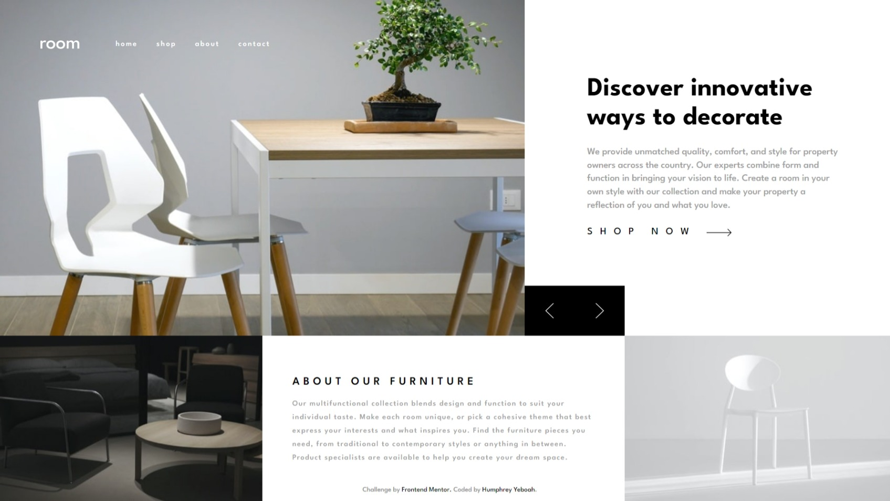

<!-- @format -->

# Frontend Mentor - Room homepage solution

This is a solution to the [Room homepage challenge on Frontend Mentor](https://www.frontendmentor.io/challenges/room-homepage-BtdBY_ENq). Frontend Mentor challenges help you improve your coding skills by building realistic projects.

## Table of contents

- [Overview](#overview)
  - [The challenge](#the-challenge)
  - [Screenshot](#screenshot)
  - [Links](#links)
- [My process](#my-process)
  - [Built with](#built-with)
  - [What I learned](#what-i-learned)
  - [Continued development](#continued-development)
  - [Useful resources](#useful-resources)
- [Author](#author)

## Overview

### The challenge

Users should be able to:

- View the optimal layout for the site depending on their device's screen size
- See hover states for all interactive elements on the page
- Navigate the slider using either their mouse/trackpad or keyboard

### Screenshot



### Links

- Solution URL: [Add solution URL here](https://github.com/hakylepremier/room-homepage-frontend)
- Live Site URL: [Add live site URL here](https://room-homepage-haky.netlify.app/)

## My process

### Built with

- Semantic HTML5 markup
- Flexbox
- BEM Methodology
- [Pug JS](https://pugjs.org/api/getting-started.html) - HTML Markup
- [Sass (Scss)](https://sass-lang.com/) - For styles
- [Webpack](https://webpack.js.org/) - Package bundler

### What I learned

I learnt how to properly use scss mixins in my work.

This is an example of a mixin i found for responsive breakpoint management:

```scss
/// Responsive breakpoint manager
/// @access public
/// @param {String} $breakpoint - Breakpoint
/// @requires $breakpoints
///
/// @example scss - Usage
/// .foo {
///   color: red;
///
///   @include respond-to('medium') {
///     color: blue;
///   }
/// }
///
/// @example css - CSS output
/// .foo {
///   color: red;
/// }
///
/// @media (min-width: 800px) {
///   .foo {
///     color: blue;
///   }
/// }
@mixin respond-to($breakpoint) {
	$raw-query: map-get($breakpoints, $breakpoint);

	@if $raw-query {
		$query: if(
			type-of($raw-query) == "string",
			unquote($raw-query),
			inspect($raw-query)
		);

		@media #{$query} {
			@content;
		}
	} @else {
		@error 'No value found for `#{$breakpoint}`. '
         + 'Please make sure it is defined in `$breakpoints` map.';
	}
}
```

I also learnt how to properly structure my scss styles thanks to the [Sass Guideline](https://sass-guidelin.es).

I also improved on my development when it comes to using Pug for my markup.

### Continued development

Moving forward I'll be focusing on being able to breakdown my Pug pages into smaller partials for easier page management.

### Useful resources

- [Sass Guideline](https://sass-guidelin.es) - This helped me to learn more about sass.
- [My Pug Scss Webpack starter repository](https://www.example.com) - This is a repository I made to make it easier for me to get going with my Pug an scss projects without too much set up.

## Author

- Website - [Humphrey Yeboah](https://www.humphreyyeboah.com)
- Frontend Mentor - [@hakylepremier](https://www.frontendmentor.io/profile/hakylepremier)
- Twitter(X) - [@hakylepremier](https://www.twitter.com/hakylepremier)
